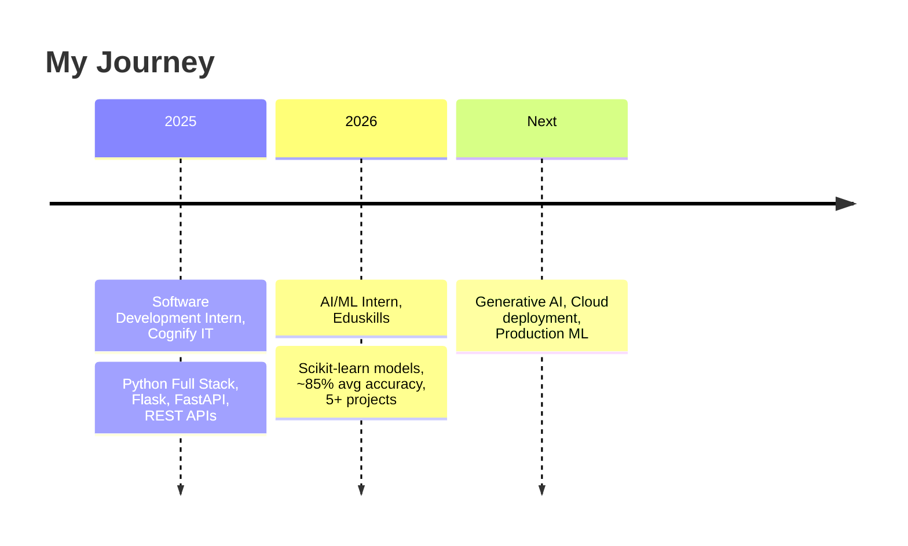

## Hi there 👋

<!--
**ashishbiswal8658-star/ashishbiswal8658-star** is a ✨ _special_ ✨ repository because its `README.md` (this file) appears on your GitHub profile.

Here are some ideas to get you started:

- 🔭 I’m currently working on ...
- 🌱 I’m currently learning ...
- 👯 I’m looking to collaborate on ...<div align="center">


<a href="https://git.io/typing-svg">

</a>

<br/>


<br/><br/>

<a href="https://www.linkedin.com/in/ashish-biswal-bb4934390"></a>
<a href="mailto:ashishbiswal8658@gmail.com"></a>
<a href="https://github.com/ashishbiswal8658-star"></a>

</div>

---

## 👨‍💻 About Me

```python
class Ashish:
    def __init__(self):
        self.role       = "B.Tech CSE (AI & ML) Student @ GITA Autonomous College"
        self.cgpa       = 9.14
        self.internship = "AI/ML Intern @ Eduskills (2026 - Present)"
        self.languages  = ["Python", "SQL", "JavaScript"]
        self.focus      = ["Machine Learning", "Backend APIs", "Data Analytics", "Generative AI"]
        self.currently  = "Building a multi-vehicle predictive road safety system"
        self.motto      = "Learn. Build. Improve. Repeat."

    def say_hi(self):
        print("Let's build something intelligent together 🚀")
```

---

## 🛠️ Tech Arsenal

<div align="center">

**Languages & Core**


**AI / ML / Data**

 

**Backend / Frontend**


**Cloud & Tools**


</div>

---

## 🔥 Featured Projects

| Project | What it does | Tech |
|---|---|---|
| 🚦 **AI Multi-Vehicle Predictive Road Safety & Accident Prevention System** | Combines weather, road, e-challan and accident datasets into a master dataset; ML risk prediction, GPS/map awareness (~300 m), Flask API, SQL database and dashboard | `Python` `Scikit-learn` `YOLO` `Flask` `SQL` |
| 🤖 **NOVA - AI Voice Assistant** | Voice-controlled assistant with speech recognition, text-to-speech and task automation | `Python` `APIs` `Speech Recognition` `TTS` |
| 🩺 **Diabetes Prediction System** | Classification system comparing Logistic Regression and Random Forest with preprocessing and visual analysis | `Scikit-learn` `Pandas` `NumPy` `Matplotlib` |

> 📌 Add repo links: `[View Code](https://github.com/ashishbiswal8658-star/REPO-NAME)` in each row.

---

## 💼 Experience



---

## 📊 GitHub Stats

<div align="center">


</div>

---

## 🐍 Contribution Snake

<div align="center">

</div>

> Setup: create `.github/workflows/snake.yml` using the [Platane/snk](https://github.com/Platane/snk) action. It generates the `output` branch automatically.

---

## 🏆 Certifications

- 🥇 **Google AI Essentials** (Google / Coursera)
- 🐍 **Python for Data Science, AI & Development** (IBM / Coursera)
- 🤖 **Introduction to Generative AI** (Google Cloud / Coursera)
- 🏅 **AI Aware Badge** (Odisha for AI)

---

## 🎯 Roadmap 2026

- [x] Python & Machine Learning fundamentals
- [x] Flask / FastAPI REST APIs
- [x] 5+ classification projects
- [ ] Deploy ML models on AWS (EC2 / Lambda)
- [ ] Complete the Road Safety system dashboard
- [ ] Learn Generative AI and LLM apps
- [ ] Contribute to open source

---

## 🤝 Let's Connect

<div align="center">

📧 **ashishbiswal8658@gmail.com** &nbsp;|&nbsp; 💼 [LinkedIn](https://www.linkedin.com/in/ashish-biswal-bb4934390) &nbsp;|&nbsp; 💻 [GitHub](https://github.com/ashishbiswal8658-star)

<i>"Learn. Build. Improve. Repeat."</i> 🚀


</div>

- 🤔 I’m looking for help with ...
- 💬 Ask me about ...
- 📫 How to reach me: ...
- 😄 Pronouns: ...
- ⚡ Fun fact: ...
-->
